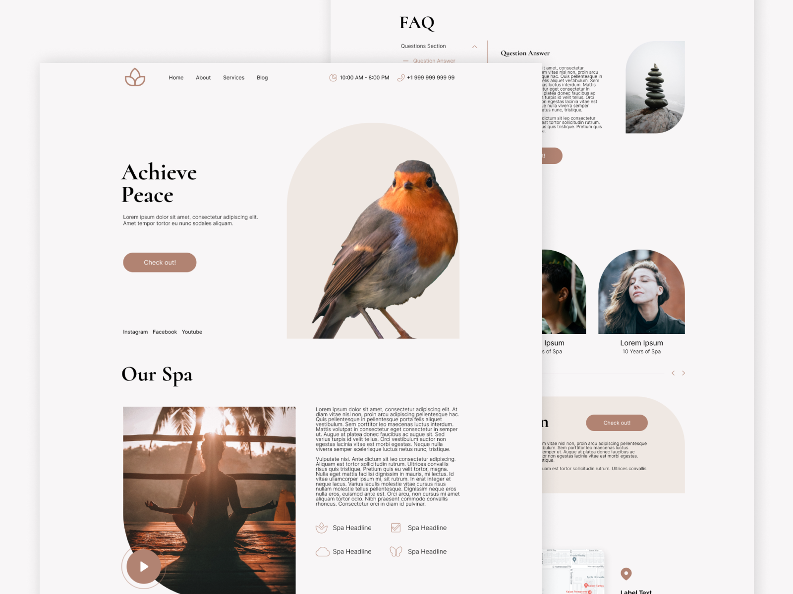

<h1 align="center">Relaxm 🧘‍♀️</h1>

Relaxm is a Spa (Health & Care) theme, prepared for the free tier of HubSpot CMS. HubSpot's free CMS tools make it easy to create a website and provide you with critical tools to help you deliver an exceptional user experience and a very kind and friendly visual. This includes a theme library, a drag-and-drop editor, premium cloud hosting, website analytics, and much more. In this guide you will learn how to use the theme within the CMS, from creating a page to customizing modules and sections.

  <a href="https://ecosystem.hubspot.com/marketplace/website/relaxm-theme-by-remotish?__hstc=129337491.f996b526c23d995a41a003a80650d745.1615842682117.1661219757042.1662080438410.902&__hssc=129337491.1.1662080438410&__hsfp=4116514488">Marketplace</a> |
  <a href="https://marketplace.remotish.agency/relaxm-theme">Demo website</a> |
  <a href="./LICENSE">License</a>

## Free and Open Source Theme
It's a free and open-source theme made by me and with help of Remotish Agency, designed in Figma to be modern, clean and developed with optimization in mind.

**The best features of this theme:**
 
- Fully responsive and mobile-friendly design
- Drag-and-drop modules
- Fully customizable
- Homepage template
- Landing page template
- Events page template
- Individual event registration page template
- Donation page template
- Volunteer sign-up page template
- Shopping page template
- About page template
- Blog listing template
- Blog post template
- All system page templates
- Product module
- Donation module
- Newsletter signup module
- Campaign and stat module
- Shopping module
- Video and image modules
- Contact Us module
- Frequently asked questions (FAQ) module
- Masonry gallery and gallery module
- Several text modules with buttons
- Customizable hero module
- Form module
- All modules are lazy load ready
- Free Google Fonts
- Native HubSpot design
- Built using a modern and professional design language
- Open-source theme

This theme incorporates the best practice recommendations and code formatting of the HubSpot CMS Boilerplate open-source theme.

## 📄 License

Permissions of this strong copyleft license are conditioned on making available complete source code of licensed works and modifications, which include larger works using a licensed work, under the same license. Copyright and license notices must be preserved. Contributors provide an express grant of patent rights.

| Permissions | Restrictions | Conditions
| --- | --- | --- 
&check; Commercial Use | &times; Liability | &#x1f6c8; License and Copyright Notice
&check; Modification   | &times; Warranty | &#x1f6c8; State changes
&check; Distribution |  | &#x1f6c8; Disclose source
&check; Patent Use |  | &#x1f6c8; Same license
&check; Private Use
